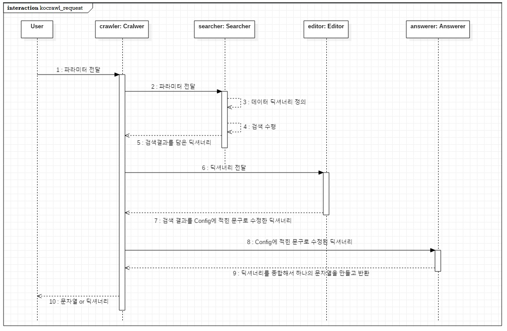
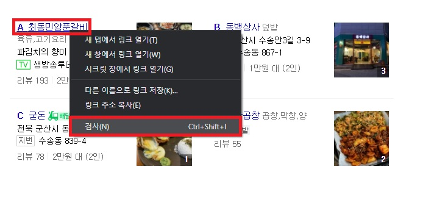
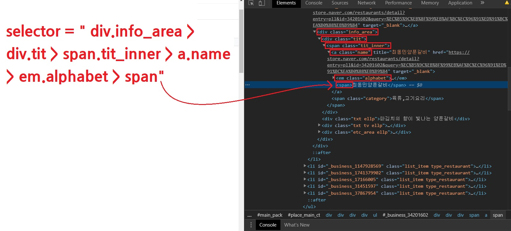
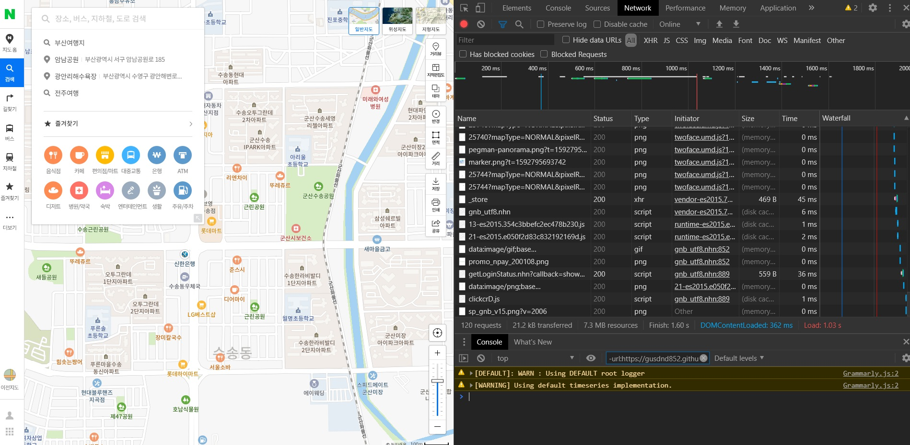
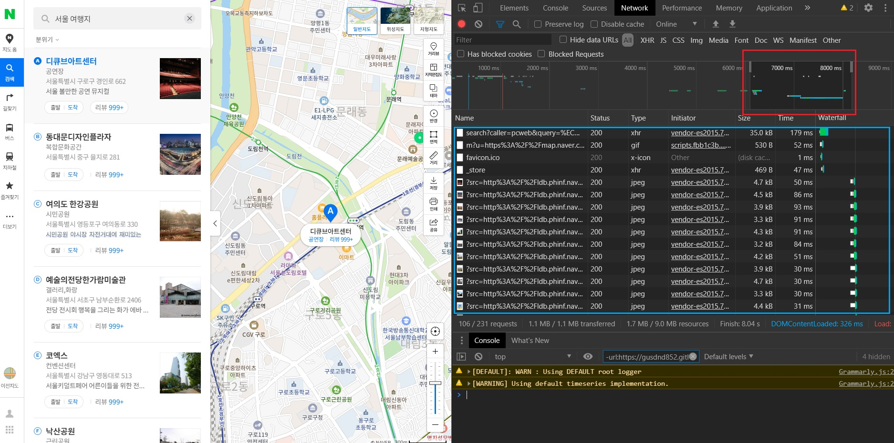
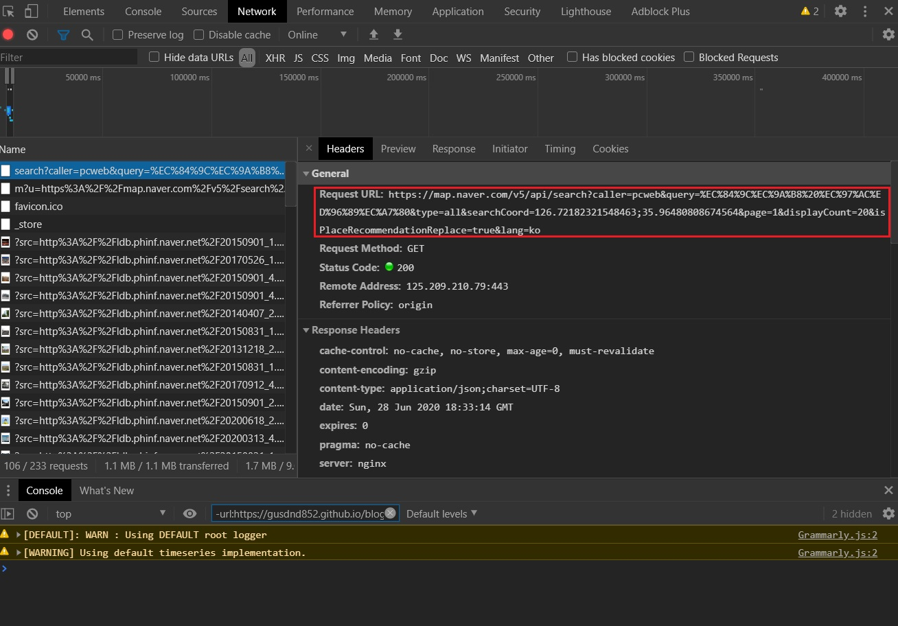
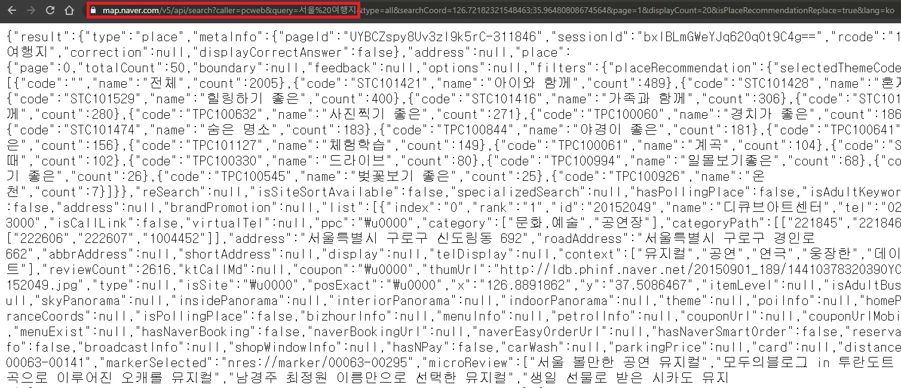
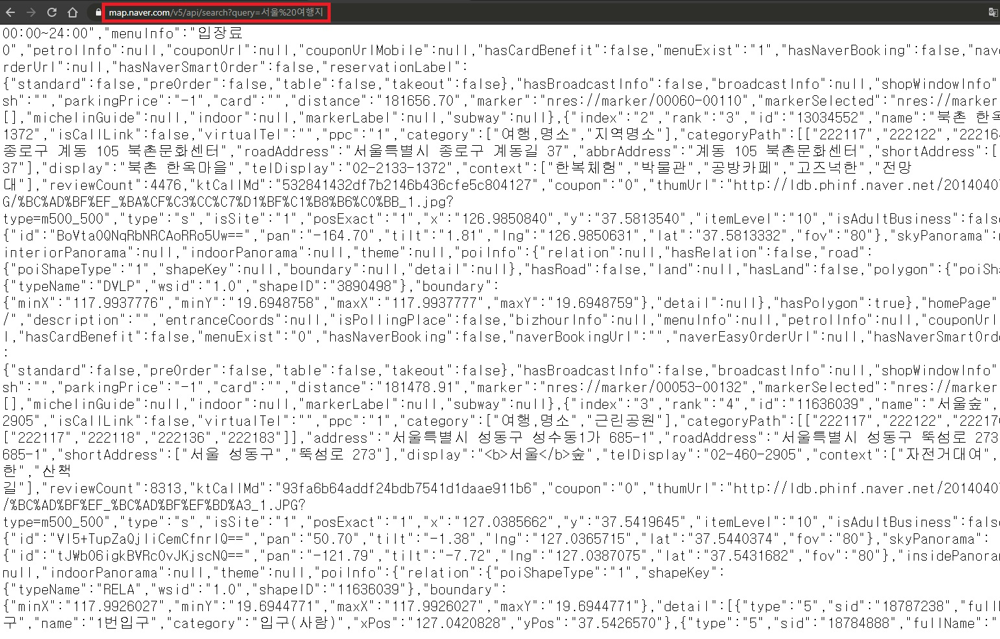

# Kocrawl
[](https://badge.fury.io/py/kocrawl)

[](https://www.codefactor.io/repository/github/gusdnd852/kocrawl)


## Table of contents
- [1. Kocrawl이란?](https://github.com/gusdnd852/kocrawl#1-kocrawl%EC%9D%B4%EB%9E%80)
    - [Waring](https://github.com/gusdnd852/kocrawl#-warning)
- [2. Getting Started](https://github.com/gusdnd852/kocrawl#2-getting-started)
- [3. Supported Features](https://github.com/gusdnd852/kocrawl#3-supported-features)
- [4. Usage](https://github.com/gusdnd852/kocrawl#4-usage)
    - [4.1. request()](https://github.com/gusdnd852/kocrawl#41-request)
    - [4.2. request_dict()](https://github.com/gusdnd852/kocrawl#42-request_dict)
    - [4.3. request_debug()](https://github.com/gusdnd852/kocrawl#43-request_debug)
- [5. Cralwer Implementation](https://github.com/gusdnd852/kocrawl#5-crawler-implementation)
    - [5.1. Kocrawl 아키텍처](https://github.com/gusdnd852/kocrawl#51-kocrawl-%EC%95%84%ED%82%A4%ED%85%8D%EC%B2%98)
    - [5.2. 해당 사이트가 정적 사이트일때](https://github.com/gusdnd852/kocrawl#52-%ED%95%B4%EB%8B%B9-%EC%82%AC%EC%9D%B4%ED%8A%B8%EA%B0%80-%EC%A0%95%EC%A0%81-%EC%82%AC%EC%9D%B4%ED%8A%B8%EC%9D%BC%EB%95%8C)
    - [5.3. 해당 사이트가 동적 사이트(ajax)일때](https://github.com/gusdnd852/kocrawl#53-%ED%95%B4%EB%8B%B9-%EC%82%AC%EC%9D%B4%ED%8A%B8%EA%B0%80-%EB%8F%99%EC%A0%81-%EC%82%AC%EC%9D%B4%ED%8A%B8ajax%EC%9D%BC%EB%95%8C)
- [6. Contributor](https://github.com/gusdnd852/kocrawl#6-contributor)
- [7. License](https://github.com/gusdnd852/kocrawl#7-license)
<br><br><br>

## 1. Kocrawl이란?

Kocrawl은 매우 간단하게 사용할 수 있는 한국어 크롤러 모음 라이브러리입니다.
이 패키지는 한달에 한번 꼴로 버그를 점검하고, 새로운 기능을 추가할 예정입니다.
이 패키지는 한국어 딥러닝 챗봇 프레임워크 [Kochat](https://github.com/gusdnd852/kochat)
을 만들때 함께 만들어졌으며, 호환성이 좋아 함께 사용하면 좋습니다.
<br><br><br>

### ⚠ Warning
Kocrawl 패키지는 네이버, 구글 등의 서비스로부터 정보를 크롤링해서 기능을 제공하고 있습니다.
모든 결과 및 데이터에 대한 저작권 및 책임은 네이버/구글 등의 정보제공자에 있으며, 
라이브러리를 상업적으로 사용하거나 불법적인 용도로 활용한 부분에 대해서는 그 어떠한 부분에 
대해서도 개발자는 책임지지 않습니다.
<br><br><br>

## 2. Getting Started 

- pip install : pip를 이용해 Kocrawl을 간단하게 다운로드 하고 사용할 수 있습니다.
```shell script
pip install kocrawl
```
<br>

- Dependencies : 패키지를 구현하는데 사용된 디펜던시는 아래와 같습니다.

```
numpy==1.18.5
beautifulsoup4==4.6.0
requests==2.24.0
``` 
<br><br><br>

## 3. Supported Features
현재 Kocrawl은 날씨, 미세먼지, 지도(장소추천), 맛집추천, 맞춤법 교정 등 5개의 API를 지원합니다.
각각 API의 지원범위는 다음과 같습니다. 아래 적힌 파라미터 (e.g. 지역, 날짜 등)은
라이브러리를 구동할 때 필요한 입력 파라미터에 해당합니다.
<br><br>

- 날씨 :  
    - 최근 업데이트 : v 1.0
    - 파라미터 1 - 지역(location) :  
        - 대한민국 전국
    - 파라미터 2 - 날짜(date) : 
        - 네이버 날씨 : 오늘(현재,지금), 내일, 모레(내일모레)
        - 구글 날씨 : 특정요일(수요일 등), 특정날짜(9월 12일 등)

<br>

- 미세먼지 : 
    - 최근 업데이트 : v 1.0
    - 파라미터 1 - 지역(location) :  
        - 대한민국 전국
    - 파라미터 2 - 날짜(date) : 
        - 네이버 미세먼지 : 오늘(현재,지금), 내일, 모레(내일모레)

<br>

- 지도(장소추천) : 
    - 최근 업데이트 : v 1.0
    - 파라미터 1 - 지역(location) :  
        - 대한민국 전국
    - 파라미터 2 - 장소(place) : 
        - 네이버 지도 : 모든 장소 검색 가능

<br>

- 맛집추천 : 
    - 최근 업데이트 : v 1.0
    - 파라미터 1 - 지역(location) :  
        - 대한민국 전국
    - 파라미터 2 - 음식점 종류(restaurant) :
        - 네이버 플레이스 : 모든 음식점 검색 가능
        - (지도 크롤러보다 다양한 정보가 제공됩니다.)

<br>

- 맞춤법교정 : 
    - 최근 업데이트 : v 1.0
    - 파라미터 1 - 문자열(text) :  
        - 네이버 맞춤법 교정 : 500글자 이하의 문자열

<br>

그 외의 API는 Issue를 통해 신청 받습니다. 만약 신청이 없다면 자체적으로 
새로운 기능을 고안하여 매달 추가하고, 신청이 있다면 매달 업데이트 때 신청된 기능들 중
한 가지 기능을 구현하여 패키지를 배포하도록 하겠습니다. 만약 현재 패키지에
포함된 기능 이외의 기능을 원하신다면 [여기](https://github.com/gusdnd852/kocrawl/issues/new) 
에서 새로운 기능을 신청해주세요.
    
<br><br><br>

## 4. Usage
기본적으로 모든 크롤러들은 `request()`와 `request_dict()`, 그리고 `request_debug()`
라는 세가지 메소드를 가지고 있습니다. 이 세가지 메소드에 대해 각각 소개해드리도록 하겠습니다.
<br><br>

### 4.1. request()
`request()`는 애플리케이션 동작 중 에러가 나지 않도록 Try-Except가 설정되어 있으며,
개발자가 미리 만들어놓은 템플릿 문장에 맞춰서 만들어진 String 리턴 값이 반환됩니다. <br><br>

4.1.1. 정상 처리시
```python
from kocrawl.weather import WeatherCrawler

crawler = WeatherCrawler()
crawler.request(location='서울', date='오늘')


>>> '서울의 날씨 정보를 전해드릴게요. 😉
    오늘 서울지역은 섭씨 21도이며, 어제보다1˚낮아요. 구름이 많이 낀 날씨에요.'
```

<br>

4.1.2. 오류 발생시
```python
from kocrawl.weather import WeatherCrawler

crawler = WeatherCrawler()
crawler.request(location='런던', date='1901년 3월 2일')

>>> '그 날씨는 알 수가 없어요.'
```
<br><br>

### 4.2. request_dict()

`request_dict()`는 애플리케이션 동작 중 에러가 나지 않도록 Try-Except가 설정되어 있으며,
사용자가 직접 메시지를 설계할 수 있게 dictionary 형태로 정보를 반환합니다. (단 오류시엔
그대로 String으로 에러 메시지가 출력됩니다.) <br><br>

4.2.1. 정상 처리시
```python
from kocrawl.weather import WeatherCrawler

crawler = WeatherCrawler()
crawler.request_dict(location='서울', date='오늘')


>>> {'today_weather': '맑음,어제보다1˚낮아요', 
     'tomorrow_morning_weather': '흐리고가끔비', 
     'tomorrow_afternoon_weather': '구름많음', 
     'after_morning_weather': '구름많음', 
     'after_afternoon_weather': '맑음', 
     'specific_weather': None, 
     'today_temperature': '21', 
     'tomorrow_morning_temperature': '20', 
     'tomorrow_afternoon_temperature': '25', 
     'after_morning_temperature': '21', 
     'after_afternoon_temperature': '29', 
     'specific_temperature': None}
```

<br>

4.2.2. 오류 발생시
```python
from kocrawl.weather import WeatherCrawler

crawler = WeatherCrawler()
crawler.request_dict(location='런던', date='1901년 3월 2일')

>>> '그 날씨는 알 수가 없어요.'
```
<br><br>


### 4.3. request_debug()

`request_debug()`는 애플리케이션 동작 중 에러가 나는 것을 확인하기 위해 
Try-Except가 설정되어 있지 않습니다. (주로 개발자인 제가 사용합니다.. ^^)
메시지와 딕셔너리가 tuple 형태로 모두 반환됩니다. <br><br>

4.3.1. 정상 처리시
```python
from kocrawl.weather import WeatherCrawler

crawler = WeatherCrawler()
crawler.request_debug(location='서울', date='오늘')

>>> ('서울의 날씨 정보를 전해드릴게요. 😉 
     오늘 서울지역은 섭씨 21도이며, 어제보다1˚낮아요. 구름이 많이 낀 날씨에요.' , 
 
    {'today_weather': '맑음,어제보다1˚낮아요', 
     'tomorrow_morning_weather': '흐리고가끔비', 
     'tomorrow_afternoon_weather': '구름많음', 
     'after_morning_weather': '구름많음', 
     'after_afternoon_weather': '맑음', 
     'specific_weather': None, 
     'today_temperature': '21', 
     'tomorrow_morning_temperature': '20', 
     'tomorrow_afternoon_temperature': '25', 
     'after_morning_temperature': '21', 
     'after_afternoon_temperature': '29', 
     'specific_temperature': None})
```

<br>

4.3.2. 오류 발생시
```python
from kocrawl.weather import WeatherCrawler

crawler = WeatherCrawler()
crawler.request_debug(location='런던', date='1901년 3월 2일')

>>>
Traceback (most recent call last):
  File "C:/Users/ASUS/Desktop/kocrawl/test/test.py", line 9, in <module>
    print(c.request_debug(location='런던', date='1901년 3월 2일'))
  File "C:\Users\ASUS\Desktop\kocrawl\kocrawl\weather.py", line 62, in request_debug
    return self.__specific(location, date)
  File "C:\Users\ASUS\Desktop\kocrawl\kocrawl\weather.py", line 109, in __specific
    result_dict = WeatherSearcher().google_search(location, date)
  File "C:\Users\ASUS\Desktop\kocrawl\kocrawl\searcher\weather_searcher.py", line 81, in google_search
    self.data_dict['specific_weather'] = re.sub(' ', '', result[0][0])
IndexError: list index out of range
```
<br><br><br>

## 5. Crawler Implementation
이 챕터에서는 다양한 상황에서 크롤러를 구현해내는 방법에 대해 간단히 소개합니다. 
<br><br>

### 5.1. Kocrawl 아키텍처
Kocrawl은 Crawler, Searcher, Editor, Answerer라는 네가지 컴포넌트로 구현되어있습니다.
구조가 매우 간단하고 객체지향을 최대한 살려서 구현했기 때문에 여러분이 새로운 크롤러를 만들 때
유용할 수 있습니다. 추가로, 라이브러리에 컨트리뷰션하실 분이 있을진 모르겠지만.. 컨트리뷰션하시려면
참고해주시길 바랍니다. 라이브러리의 전체적인 동작에 관련된 시퀀스 다이어그램을 아래에 첨부합니다.<br><br>



<br>

###  5.2. 해당 사이트가 정적 사이트일때
정적 사이트는 beautifulsoup과 CSS 셀렉터로 구현합니다. 
셀렉터를 딸 때는 구글크롬을 사용하는 것이 효과적입니다.
아래처럼 원하는 부분을 우클릭하고 '검사'를 클릭합니다.
<br><br>



그러면 오른쪽처럼 웹페이지의 소스코드를 볼 수 있습니다.
이 소스코드에서 원하는 컴포넌트의 셀렉터를 따야합니다. 
<br><br>



위 처럼 셀렉터 String을 만들고, bs4의 select()에 입력하면 원하는 컴포넌트를
크롤링 할 수 있습니다. 복잡해보이지만 아래의 4가지 CSS 셀렉터 규칙만 알면 거의 
대부분의 셀렉터를 딸 수 있습니다. 
<br><br>

```
1. 태그의 경우 그대로 적습니다 (e.g. <div> → div)
2. 클래스의 경우 '.' 뒤에 적습니다. (e.g. class="name" → .name)
3. 아이디의 경우 '#' 뒤에 적습니다. (e.g. id="some_id" → #some_id)
4. 하위 요소로 접근할 때는 '>' 를 사용합니다 (e.g. div.info_area > div.tit)
```

만들어낸 셀렉터 문자열을 이용해 bs4로 검색하고 적절히 보기 좋게 수정한 뒤 
사용자에게 반환하면 됩니다. 만약 이 4가지 규칙으로 원하는 요소에 접근할 수 없다면 
구글에 'CSS 셀렉터'를 검색하셔서 더 세부적인 규칙을 확인하고 셀렉터를 작성해주세요.
    
<br>

###  5.3. 해당 사이트가 동적 사이트(ajax)일때
동적 사이트의 경우 HTTP 통신 중 GET을 사용한다면 requests와 json을 이용하여 매우 쉽게 크롤링 할 수 있습니다.
만약 POST를 사용한다면 Selenium 같이 실제로 브라우저를 띄우고 크롤링 하는 방식을 사용해야 
하는데 Kocrawl은 이런 방식의 크롤링은 다루지 않을 예정입니다. 여기에서는 GET 방식 크롤링만
알려드리도록 하겠습니다. 이번에는 구글크롬의 Network 툴을 이용합니다. 구글크롬을 열어서 F12를 눌러서 개발자 도구를 열고, Network를 눌러봅시다.
<br><br>



위와 같은 화면을 볼 수 있습니다. 이 때 우리가 원하는 기능을 실행해봅시다.
여기에서는 네이버 지도를 크롤링해보겠습니다. 네이버 지도는 동적으로 구현되어
셀렉터 방식으로는 검색결과를 크롤링 할 수 없습니다.
네트워크 툴을 열고 있는 상태에서 원하는 기능을 수행해봅시다. ('서울 여행지' 검색)
<br><br>




원하는 기능을 수행하면 수행하는 동안 위의 시간 탭이 변하게 됩니다.
이 때, 빨간색 네모칸 처럼 내가 수행했던 구간만 선택하면 그 시간 동안 수행한 request를 전부 열람할 수 있습니다.
파란색 네모칸에 주고받은 모든 요소가 나오게 됩니다. 대부분은 사진들이고 위쪽에 
4개의 요소만 사진이 아닙니다. 이 때, 사이즈와 시간이 제일 큰 가장 위 요소가 지도 API일 확률이 높습니다.
해당 요소를 클릭해봅시다.
<br><br>




빨간색 네모칸에 request에 필요한 url이 나오게 됩니다. 이 url로 접속해봅시다.
<br><br>



네이버 지도 api의 결과가 출력되었습니다.
이 때, url을 보면 뒷쪽에 너저분하게 여러가지 파라미터가 붙어있는데
여기에서 중요한 파라미터만 남깁니다. qeury는 검색어이기 때문에 가장 중요한 파라미터이고
나머지는 별로 필요 없어보이기 때문에 날리겠습니다. 
만약 문제가 생긴다면 여러번 시도하면서
필수 파라미터만 남기고 다 없애는 것이 좋습니다.
<br><br>



qeury를 제외한 모든 파라미터를 날려도 정상적으로 작동하기 때문에 qeury만 남기고 이 url을
활용하여 크롤링을 수행합니다. 즉, `https://map.naver.com/v5/api/search?query=` 
뒤에 사용자 입력 쿼리를 붙여서 검색하면 됩니다. 이 url을 이용해 파이썬에서 
requests 모듈을 사용해서 접속하고, json 모듈을 통해서 원하는 정보만 잘라내서 사용하면 됩니다.
~~자 이제 제가 만드는법 다 알려드렸으니 어서 이제 컨트리뷰션만 해주시면 됩니...~~
<br><br><br>


## 6. Contributor
만약 본인이 원하는 기능을 Kocrawl에 추가하고 싶으시다면 언제든지 컨트리뷰션 할 수 있습니다.
저와 함께 즐겁고 힘겨운 크롤링의 여정을 떠나실 준비가 되신 분들이라면 얼마든지 환영합니다. ^___^
<br><br><br>

## 7. License

```
Copyright 2020 Kocrawl.

Licensed under the Apache License, Version 2.0 (the "License");
you may not use this file except in compliance with the License.
You may obtain a copy of the License at

http://www.apache.org/licenses/LICENSE-2.0

Unless required by applicable law or agreed to in writing, software
distributed under the License is distributed on an "AS IS" BASIS,
WITHOUT WARRANTIES OR CONDITIONS OF ANY KIND, either express or implied.
See the License for the specific language governing permissions and
limitations under the License.
```